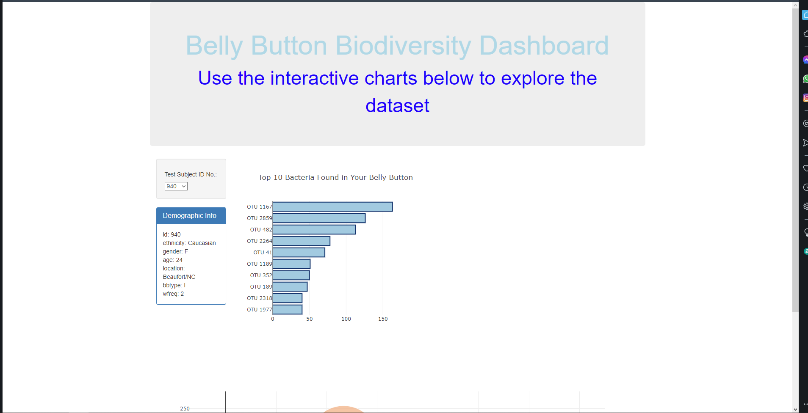
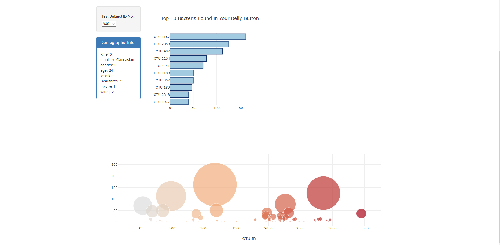

# Belly Button Microbe 

Purpose: 

The purpose of this repository was to take data related to belly button microbes from a samples.json to create a bar chart with the top ten OTU IDs and a bubble chart which would be displayed on a static page with a interactive console that shows Demographic data and can be changed by a user which would then change the bubble chart to match with it.

Main Code Components:

Javascript/D3

HTML

1. In app.js Read sample.json using D3
2. Create a horizontal bar chart depicting the Top 10 Bacteria in Belly Button 
    - samples_value as value for chart 
    - otu_ids as labels
    - otu_labels as hovertext
3. Create a bubble chart 
    - otu_ids as x
    - sample_values as y 
    - sample_values for marker size
    - otu_ids as marker colors
    - otu_labels as text values
 4. Create function for MetaData that would display individual's info from data
 5. Create init function to have firstsample as constant and to allow all plots and data to be updated 
 6. Create a index.html 
    - Inside write code to house: title, Test Subject ID No. w/ option change, Demographic Info, bar chart, and bubble chart   

 
